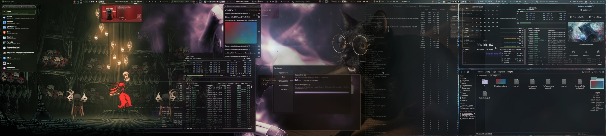
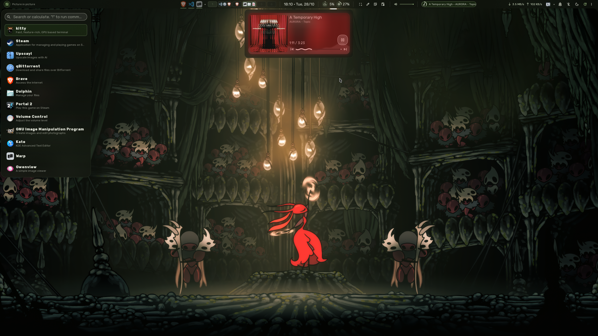
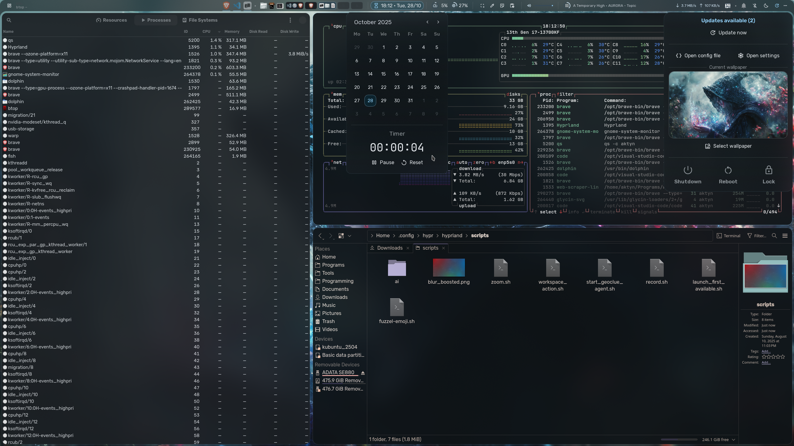
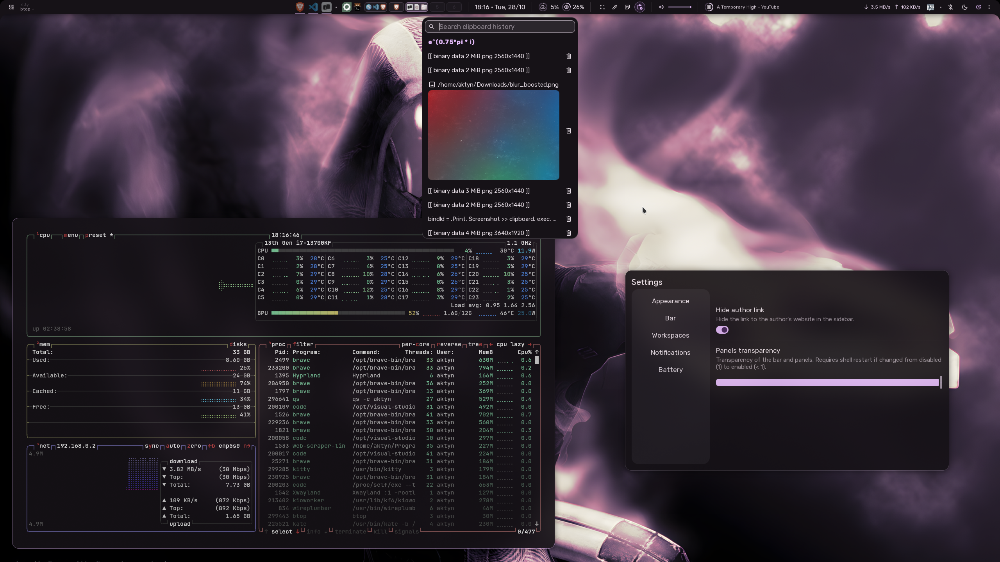
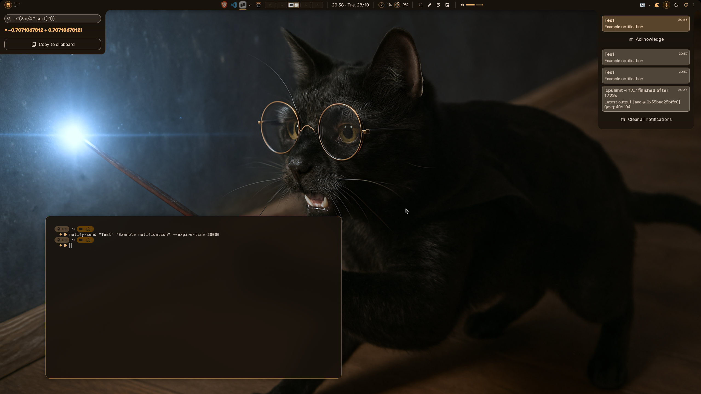

# Personalized [Hyprland](https://hypr.land/) Setup

A comprehensive, feature-rich Hyprland configuration with Quickshell integration, custom SDDM theme, and carefully selected applications for an optimal desktop experience.  
This configuration is made for personal use although I'm happy to implement additional features upon request.  
[Open an issue to request features](https://github.com/Aktyn/hyprland-setup/issues/new)



## 🚀 Installation

The `install.sh` script automatically installs all required packages, suggested applications, and sets up a customized Hyprland configuration with feature-rich Quickshell.

**⚠️ Important:** This script will override your existing Hyprland configuration. Please backup your current setup before proceeding.

### Prerequisites

- **Arch-based Linux distribution** (required)
- **Hyprland** should already be installed on your system
- **Sudo access** for package installation
- **Minimum 20% battery level** (on laptops)

### Installation Methods

#### Method 1: Clone and Run (Recommended)

```sh
git clone https://github.com/Aktyn/hyprland-setup.git
cd hyprland-setup
./install.sh
```

#### Method 2: One-liner Installation

Run directly with wget:

```sh
${SHELL:-sh} -c "$(wget -qO - https://raw.githubusercontent.com/Aktyn/hyprland-setup/main/install.sh)"
```

Or with curl:

```sh
${SHELL:-sh} -c "$(curl -Ls https://raw.githubusercontent.com/Aktyn/hyprland-setup/main/install.sh)"
```

## 📦 Installed Packages and Applications

### System Tools & Utilities

- **git** - Version control system
- **python** - Python programming language
- **base-devel** - Development tools (make, gcc, etc.)
- **yay** - AUR helper (automatically installed if missing)
- **python-pillow** - Python Imaging Library fork
- **python-materialyoucolor-git** (AUR) - Python library for generating Material You color schemes

### Text Editors & Terminals

- **kate** - Advanced text editor with syntax highlighting
- **warp-terminal-bin** (AUR) - Modern terminal emulator
- **kitty** - Default terminal for quick tasks
- **fish** - Default shell

### System Monitoring & Management

- **gnome-system-monitor** - System resource monitor
- **btop** - Resource monitor that shows usage and stats
- **blueman** - Bluetooth management GUI
- **pavucontrol** - Volume control GUI
- **cava** - Audio visualizer
- **plasma-nm** - KDE's network manager applet
- **plasma-activities** - KDE activities service
- **systemsettings** - KDE system settings
- **nwg-look** - GTK3 settings editor for wlroots compositors

### Clipboard & Utilities

- **xclip** - Command-line clipboard interface
- **cliphist** - Clipboard history manager
- **wl-clipboard** - Command-line copy/paste utilities for Wayland
- **gnome-keyring** - GNOME Keyring daemon for securely storing sensitive information
- **polkit-kde-agent** - PolicyKit authentication agent that handles privilege elevation prompts
- **kdialog** - KDE dialog boxes for scripts
- **Dolphin** - KDE's file manager
- **grim**, **slurp**, **tesseract** - Packages required for OCR features
- **playerctl** (AUR) - Command-line utility to control media players
- **libdbusmenu-gtk3** (AUR) - Library for passing menu structures over DBus

### Theming & Fonts

- **gnome-themes-extra** - Extra GTK themes
- **ttf-material-icons** (AUR) - Material Design icons
- **ttf-material-symbols-variable** (AUR) - Variable Material symbols font
- **ttf-jetbrains-mono-nerd** (AUR) - JetBrains Mono Nerd Font
- **ttf-readex-pro** (AUR) - Readex Pro font
- **ttf-rubik-vf** (AUR) - Rubik font

### Image Viewing & Processing

- **gwenview** - Image viewer
- **imagemagick** (AUR) - Image manipulation tools

### Qt Framework Dependencies

- **qt5-wayland** & **qt6-wayland** - Wayland support
- **qt5-multimedia** & **qt6-multimedia** - Multimedia support
- **qt5-imageformats** & **qt6-imageformats** - Additional image formats
- **qt5-svg** & **qt6-svg** - SVG support
- **qt5-declarative** - QML support
- **qt5-graphicaleffects** - Visual effects

### Hyprland Ecosystem

- **hyprsunset** - Blue light filter
- **hypridle** - Hyprland’s idle management daemon
- **hyprlock** - Screen lock for Hyprland
- **hyprpicker** - Color picker
- **hyprshot** - Screenshot utility
- **quickshell** (AUR) - Customizable desktop shell

### Display Manager

- **SDDM** with custom theme (automatically configured)

## 🔄 Updates

To update to the newest version, simply run the installation script again. It will automatically update your Hyprland and Quickshell setup while preserving your customizations.

## 📸 Previews

Here's a glimpse of the customized Hyprland setup with Quickshell integration:






## 🎯 Features

- **Custom Hyprland Configuration** - Optimized settings for productivity and aesthetics
- **Quickshell Integration** - Feature-rich desktop environment with widgets, panels, and utilities
- **Custom SDDM Theme** - Beautiful login screen matching the desktop theme
- **Material Design Icons** - Modern icon set for consistent visual experience
- **Clipboard Management** - Advanced clipboard history and management
- **System Monitoring** - Built-in resource monitoring and system information
- **Audio Visualization** - Real-time audio visualizer with Cava
- **Bluetooth Support** - Easy Bluetooth device management
- **And much more!** - Explore the full feature set after installation
